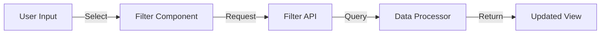

# Azure Cost Analysis Dashboard - Technical Documentation

## System Architecture

### Overview
The Azure Cost Analysis Dashboard is built on a modern web architecture that combines the robustness of Flask for backend operations with the reactivity of Vue.js for frontend interactions. This document provides detailed technical specifications and architectural insights.

### Architecture Layers

#### 1. Presentation Layer (Frontend)
- **Framework**: Vue.js 2.6
- **Styling**: Tailwind CSS
- **Components**:
  - Dashboard Container
  - Navigation Component
  - Filter Panel
  - Data Tables
  - Cost Summary Cards
  - Chart Components

#### 2. Application Layer (Backend)
- **Framework**: Flask (Python)
- **Key Components**:
  - Route Handlers
  - Data Processors
  - Cost Calculators
  - Filter Managers
  - API Controllers

#### 3. Data Layer
- **Storage**: CSV File System
- **Data Processing**: Pandas DataFrame
- **Caching**: In-memory caching

## Component Specifications

### Frontend Components

#### 1. Dashboard Container
```javascript
// Main dashboard component structure
{
  name: 'Dashboard',
  data() {
    return {
      activeTab: 'overview',
      filters: {},
      metrics: {}
    }
  }
}
```

#### 2. Filter Panel
```javascript
// Filter component structure
{
  name: 'FilterPanel',
  props: ['availableFilters'],
  data() {
    return {
      selectedFilters: {}
    }
  }
}
```

### Backend Components

#### 1. Data Processor
```python
class DataProcessor:
    def __init__(self):
        self.data = None
        self.cache = {}

    def load_data(self):
        # Load CSV data
        pass

    def process_data(self):
        # Process raw data
        pass
```

#### 2. Cost Calculator
```python
class CostCalculator:
    def calculate_totals(self):
        # Calculate cost totals
        pass

    def calculate_percentages(self):
        # Calculate cost percentages
        pass
```

## Data Flow Diagrams

### 1. Main Data Flow


### 2. Filter Flow


## API Specifications

### 1. Cost Analysis Endpoints

#### Get Top 5 Subscriptions
```yaml
Endpoint: /api/top5Subscriptions
Method: GET
Response:
  200:
    description: Successfully retrieved subscriptions
    schema:
      type: array
      items:
        type: object
        properties:
          SUBSCRIPTIONNAME: string
          Sum_of_Cost: number
          Formatted_Cost: string
```

#### Get Top 5 Applications
```yaml
Endpoint: /api/top5Applications
Method: GET
Response:
  200:
    description: Successfully retrieved applications
    schema:
      type: array
      items:
        type: object
        properties:
          APPLICATION: string
          Sum_of_Cost: number
          Formatted_Cost: string
```

### 2. Filter Endpoints

#### Apply Filters
```yaml
Endpoint: /api/applyFilters
Method: POST
Request:
  content:
    application/json:
      schema:
        type: object
        properties:
          startDate: string
          subscriptionId: string
          application: string
          serviceName: string
Response:
  200:
    description: Successfully applied filters
```

## Security Considerations

### 1. Data Protection
- CSV file access restrictions
- Input validation for all API endpoints
- Sanitization of user inputs

### 2. Error Handling
- Graceful error handling for all API endpoints
- Proper error messages and logging
- Rate limiting implementation

## Performance Optimizations

### 1. Data Processing
- Efficient CSV reading using chunks
- Data caching mechanisms
- Optimized data aggregation

### 2. Frontend Optimization
- Lazy loading of components
- Efficient re-rendering strategies
- Proper use of Vue.js computed properties

## Testing Strategy

### 1. Unit Tests
- Backend component testing
- Data processing validation
- Cost calculation verification

### 2. Integration Tests
- API endpoint testing
- Filter functionality testing
- Data flow validation

### 3. Frontend Tests
- Component rendering tests
- User interaction tests
- State management tests

## Deployment Guidelines

### 1. Prerequisites
- Python 3.8+
- pip package manager
- Virtual environment setup

### 2. Installation Steps
```bash
# Create virtual environment
python -m venv venv

# Activate virtual environment
.\venv\Scripts\activate  # Windows

# Install dependencies
pip install -r requirements.txt

# Run application
python app.py
```

### 3. Configuration
- Environment variables setup
- Debug mode configuration
- Logging configuration

## Maintenance and Monitoring

### 1. Logging
- Application level logging
- Error tracking
- Usage metrics

### 2. Monitoring
- Performance monitoring
- Error rate tracking
- User activity monitoring

## Future Enhancements

### 1. Planned Features
- Export functionality
- Advanced filtering options
- Custom date ranges
- Cost forecasting

### 2. Technical Improvements
- Real-time data updates
- Enhanced caching
- Advanced visualization options
