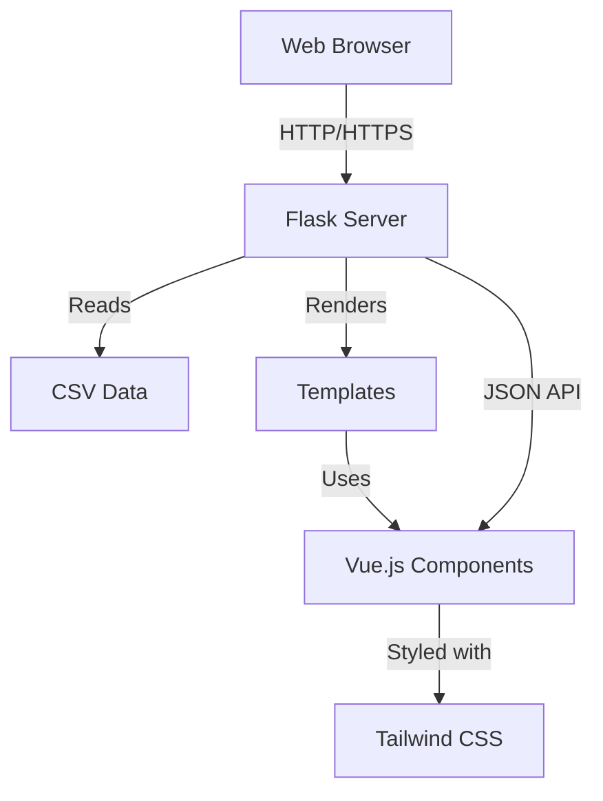
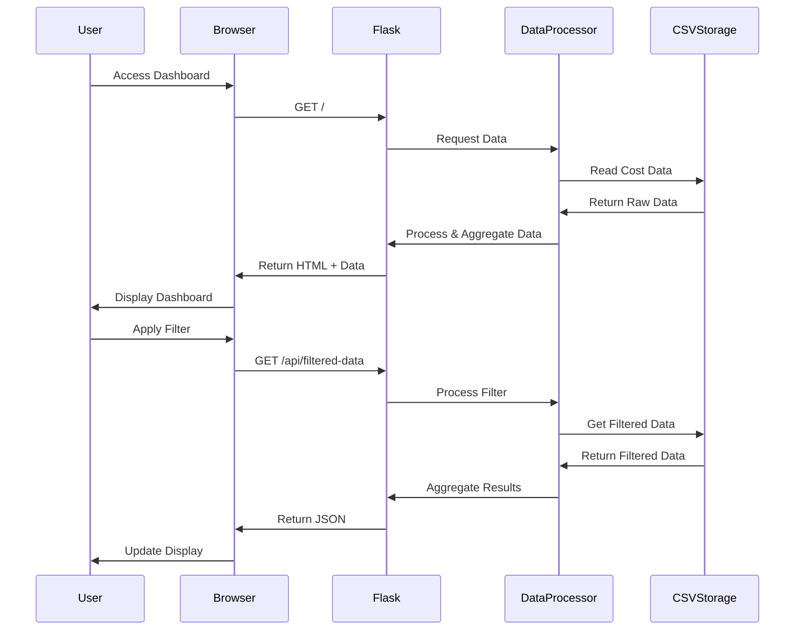
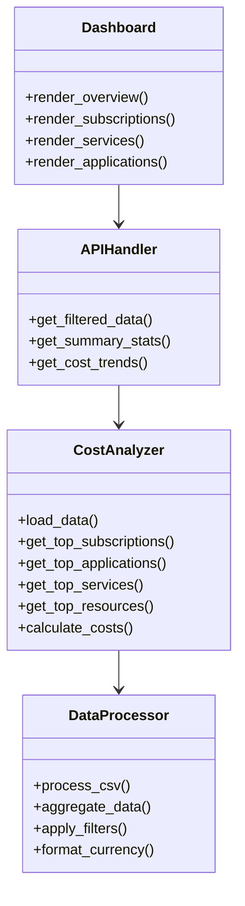

# Azure Cost Analysis Dashboard

## Overview
A comprehensive dashboard for analyzing Azure costs across subscriptions, services, and resources. Built with Flask, Vue.js, and Tailwind CSS, this application provides detailed insights into Azure resource consumption and associated costs.

## Features
- **Real-time Cost Analysis**: View and analyze Azure costs across different dimensions
- **Multiple Views**:
  - Overview Dashboard
  - Subscription Cost Analysis
  - Service Names Analysis
  - Application Cost Breakdown
  - Resource Utilization Costs
- **Interactive Filtering**: Filter data by:
  - Date
  - Subscription ID
  - Application
  - Service Name
- **Top 5 Analysis** for:
  - Subscriptions
  - Applications
  - Service Names
  - Resources

## Architecture

### Component Architecture


### Sequence Diagram


### Class Diagram


## Technical Stack
- **Backend**: Python Flask
- **Frontend**: Vue.js 2.6
- **CSS Framework**: Tailwind CSS
- **Data Visualization**: Chart.js
- **Data Storage**: CSV File System

## Installation

### Prerequisites
- Python 3.8 or higher
- pip (Python package manager)
- Git

### Setup Steps
1. Clone the repository:
   ```bash
   git clone https://github.com/sujithre/Dashboard.git
   cd Dashboard
   ```

2. Create and activate virtual environment:
   ```bash
   python -m venv venv
   .\venv\Scripts\activate  # Windows
   ```

3. Install dependencies:
   ```bash
   pip install -r requirements.txt
   ```

4. Run the application:
   ```bash
   python app.py
   ```

## Project Structure
```
project-root/
├── app.py                 # Main Flask application
├── static/               # Static assets
│   └── js/
│       └── main.js      # Vue.js application code
├── templates/           # HTML templates
│   └── index.html      # Main dashboard template
├── src/                # Source files
├── Cosrdetails-Feb.csv # Cost data
└── requirements.txt    # Python dependencies
```

## Data Structure
The application processes CSV data with the following structure:
```csv
SubscriptionId,ServiceName,ResourceGroupName,Cost,APPLICATION,SUBSCRIPTIONNAME,
CLARITYID,BILLINGCONTACT,COSTCENTER,ENVIRONMENT,DISPLAYNAME,EMAIL,StartDate
```

## API Endpoints

### Cost Analysis Endpoints
- `GET /api/top5Subscriptions` - Get top 5 subscriptions by cost
- `GET /api/top5Applications` - Get top 5 applications by cost
- `GET /api/top5ServiceNames` - Get top 5 service names by cost
- `GET /api/top5Resources` - Get top 5 resources by cost
- `GET /api/costSummary` - Get overall cost summary

### Filter Endpoints
- `GET /api/filters` - Get available filter options
- `POST /api/applyFilters` - Apply selected filters

## Development

### Setting Up Development Environment
1. Clone the dev branch:
   ```bash
   git clone -b dev https://github.com/sujithre/Dashboard.git
   ```

2. Install development dependencies:
   ```bash
   pip install -r requirements.txt
   ```

3. Run in debug mode:
   ```bash
   $env:FLASK_DEBUG=1
   python -m flask run
   ```

### Contributing
1. Create a feature branch from dev
2. Make your changes
3. Submit a pull request to dev branch

## Testing
Run tests using:
```bash
python -m pytest
```

## License
MIT License

## Contact
For any queries, please reach out to the project maintainers.
