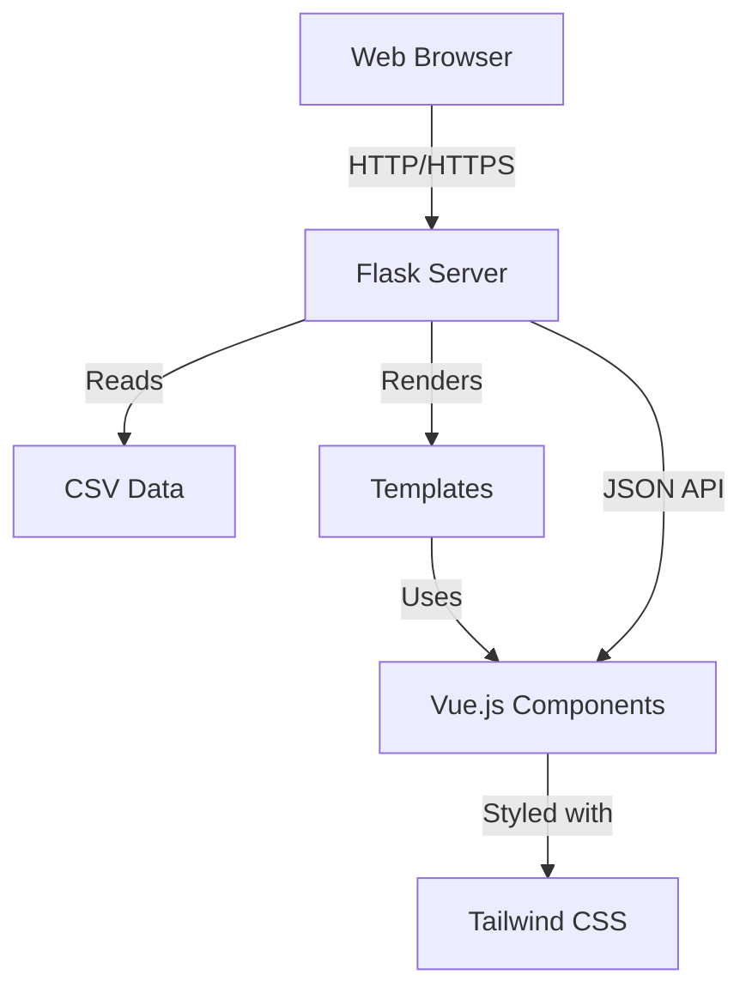
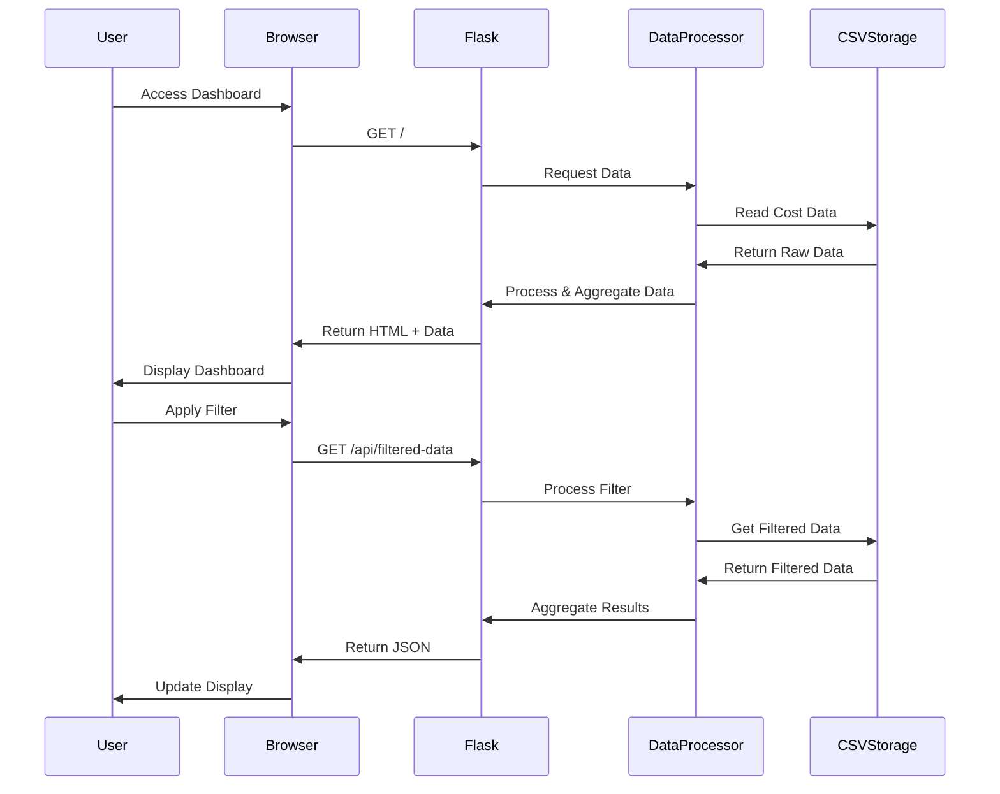
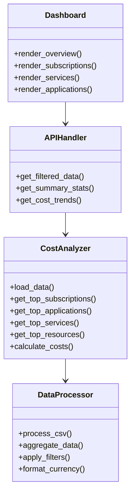

# Azure Cost Analysis Dashboard

## Overview
A comprehensive dashboard for analyzing Azure costs across subscriptions, services, and resources. Built with Flask, Vue.js, and Tailwind CSS, this application provides detailed insights into Azure resource consumption and associated costs.

## Features
- **Real-time Cost Analysis**: View and analyze Azure costs across different dimensions
- **Multiple Views**:
  - Overview Dashboard
  - Subscription Cost Analysis
  - Service Names Analysis
  - Application Cost Breakdown
  - Resource Utilization Costs
- **Interactive Filtering**: Filter data by:
  - Date
  - Subscription ID
  - Application
  - Service Name
- **Top 5 Analysis** for:
  - Subscriptions
  - Applications
  - Service Names
  - Resources
- **Performance Optimized**: CSV data caching for faster response times
- **Fully Tested**: 97% code coverage with comprehensive unit tests

## Quick Start

### Prerequisites
- Python 3.8 or higher
- pip (Python package manager)
- Git

### Installation

1. **Clone the repository:**
   ```bash
   git clone https://github.com/sujithre/Dashboard.git
   cd Dashboard
   ```

2. **Create and activate virtual environment:**
   ```bash
   # On Windows
   python -m venv venv
   .\venv\Scripts\activate

   # On macOS/Linux
   python3 -m venv venv
   source venv/bin/activate
   ```

3. **Install dependencies:**
   ```bash
   pip install -r requirements.txt
   ```

4. **Prepare your data:**
   - Place your Azure cost CSV file as `Cosrdetails-Feb.csv` in the project root
   - The CSV should have the following columns:
     - SubscriptionId, ServiceName, ResourceGroupName, Cost, APPLICATION
     - SUBSCRIPTIONNAME, CLARITYID, BILLINGCONTACT, COSTCENTER
     - ENVIRONMENT, DISPLAYNAME, EMAIL, StartDate

5. **Run the application:**
   ```bash
   python app.py
   ```

6. **Access the dashboard:**
   - Open your browser and navigate to `http://localhost:5000`

## Development Setup

### Install Development Dependencies
```bash
pip install -r requirements-dev.txt
```

### Running Tests
```bash
# Run all tests
pytest

# Run with coverage report
pytest --cov=. --cov-report=html

# Run specific test file
pytest tests/test_app.py -v
```

### Code Quality Checks

**Linting with flake8:**
```bash
flake8 app.py tests/
```

**Code Formatting with Black:**
```bash
# Check formatting
black --check app.py

# Auto-format code
black app.py
```

**Type Checking with mypy:**
```bash
mypy app.py
```

### Architecture

### Component Architecture

```mermaid
graph TD
    A[Web Browser] -->|HTTP/HTTPS| B[Flask Server]
    B -->|Reads| C[CSV Data]
    B -->|Renders| D[Templates]
    D -->|Uses| E[Vue.js Components]
    E -->|Styled with| F[Tailwind CSS]
    B -->|JSON API| E
```

### Sequence Diagram

```mermaid
sequenceDiagram
    participant User
    participant Browser
    participant Flask
    participant DataProcessor
    participant CSVStorage

    User->>Browser: Access Dashboard
    Browser->>Flask: GET /
    Flask->>DataProcessor: Request Data
    DataProcessor->>CSVStorage: Read Cost Data
    CSVStorage->>DataProcessor: Return Raw Data
    DataProcessor->>Flask: Process & Aggregate Data
    Flask->>Browser: Return HTML + Data
    Browser->>User: Display Dashboard

    User->>Browser: Apply Filter
    Browser->>Flask: GET /api/filtered-data
    Flask->>DataProcessor: Process Filter
    DataProcessor->>CSVStorage: Get Filtered Data
    CSVStorage->>DataProcessor: Return Filtered Data
    DataProcessor->>Flask: Aggregate Results
    Flask->>Browser: Return JSON
    Browser->>User: Update Display
```

### Class Diagram

```mermaid
classDiagram
    class CostAnalyzer {
        +load_data()
        +get_top_subscriptions()
        +get_top_applications()
        +get_top_services()
        +get_top_resources()
        +calculate_costs()
    }
    class DataProcessor {
        +process_csv()
        +aggregate_data()
        +apply_filters()
        +format_currency()
    }
    class APIHandler {
        +get_filtered_data()
        +get_summary_stats()
        +get_cost_trends()
    }
    class Dashboard {
        +render_overview()
        +render_subscriptions()
        +render_services()
        +render_applications()
    }
    
    CostAnalyzer --> DataProcessor
    APIHandler --> CostAnalyzer
    Dashboard --> APIHandler
```

## Technical Stack
- **Backend**: Python Flask 2.3.2
- **Frontend**: Vue.js 2.6 (via CDN)
- **CSS Framework**: Tailwind CSS (via CDN)
- **Data Visualization**: Chart.js (via CDN)
- **Data Storage**: CSV File System with in-memory caching
- **Testing**: pytest, pytest-flask, pytest-cov
- **Code Quality**: flake8, pylint, black, mypy

## Project Structure
```
Dashboard/
├── app.py                    # Main Flask application with API endpoints
├── static/
│   └── js/
│       └── main.js          # Vue.js application code
├── templates/
│   └── index.html           # Main dashboard template
├── tests/
│   ├── __init__.py
│   └── test_app.py          # Comprehensive test suite
├── Cosrdetails-Feb.csv      # Sample cost data (replace with your data)
├── requirements.txt         # Production dependencies
├── requirements-dev.txt     # Development dependencies
├── pyproject.toml           # Tool configuration
├── .flake8                  # Flake8 configuration
├── .gitignore               # Git ignore patterns
├── README.md                # This file
├── DOCUMENTATION.md         # Technical documentation
└── Dockerfile               # Docker configuration
```

## Data Structure
The application processes CSV data with the following structure:
```csv
SubscriptionId,ServiceName,ResourceGroupName,Cost,APPLICATION,SUBSCRIPTIONNAME,
CLARITYID,BILLINGCONTACT,COSTCENTER,ENVIRONMENT,DISPLAYNAME,EMAIL,StartDate
```

### Sample Data Format
```csv
sub-001,Virtual Machines,rg-prod,1500.50,WebApp,Production Subscription,C001,billing@example.com,CC001,Production,VM-Prod,admin@example.com,2024-02-01
```

## API Endpoints

### Cost Analysis Endpoints
- `GET /api/top5Subscriptions` - Get top 5 subscriptions by cost
- `GET /api/top5Applications` - Get top 5 applications by cost
- `GET /api/top5ServiceNames` - Get top 5 service names by cost
- `GET /api/top5Resources` - Get top 5 resources by cost
- `GET /api/costSummary` - Get overall cost summary

## API Endpoints

### Cost Analysis Endpoints

#### `GET /api/top5Subscriptions`
Returns the top 5 subscriptions by total cost.

**Response:**
```json
{
  "data": [
    {
      "SUBSCRIPTIONNAME": "Production Subscription",
      "Sum of Cost": 150000.50
    }
  ],
  "total": 750000.00
}
```

#### `GET /api/top5Applications`
Returns the top 5 applications by total cost.

#### `GET /api/top5ServiceNames`
Returns the top 5 Azure service names by total cost.

#### `GET /api/top5Resources`
Returns the top 5 resource groups by total cost.

#### `GET /api/SumofCost`
Returns costs aggregated by date.

**Response:**
```json
{
  "dates": ["2024-02-01", "2024-02-02"],
  "costs": [5000.50, 6200.75]
}
```

#### `GET /api/data`
Returns all cost data for client-side filtering.

## Performance Optimization

### Data Caching
The application implements LRU caching for CSV data loading:
- CSV data is loaded once and cached in memory
- Subsequent requests use cached data for faster response times
- Cache is automatically cleared when the application restarts

### Frontend Optimization
- Vue.js reactive data binding minimizes DOM manipulations
- Chart.js efficiently renders cost visualizations
- Tailwind CSS provides optimized, utility-first styling

## Deployment

### Production Configuration

1. **Set Flask to production mode:**
   ```bash
   export FLASK_ENV=production
   export FLASK_DEBUG=0
   ```

2. **Use a production WSGI server (e.g., Gunicorn):**
   ```bash
   pip install gunicorn
   gunicorn -w 4 -b 0.0.0.0:5000 app:app
   ```

3. **Docker Deployment:**
   ```bash
   docker build -t azure-cost-dashboard .
   docker run -p 5000:5000 azure-cost-dashboard
   ```

### Environment Variables
- `FLASK_ENV`: Set to `production` for production deployment
- `FLASK_DEBUG`: Set to `0` for production

## Troubleshooting

### Common Issues

#### CSV File Not Found
**Error:** `Error loading CSV: [Errno 2] No such file or directory: 'Cosrdetails-Feb.csv'`

**Solution:** Ensure your CSV file is named `Cosrdetails-Feb.csv` and is located in the project root directory.

#### Port Already in Use
**Error:** `OSError: [Errno 48] Address already in use`

**Solution:** 
```bash
# Find and kill the process using port 5000
# On Windows
netstat -ano | findstr :5000
taskkill /PID <PID> /F

# On macOS/Linux
lsof -ti:5000 | xargs kill -9
```

#### Missing Dependencies
**Error:** `ModuleNotFoundError: No module named 'flask'`

**Solution:**
```bash
pip install -r requirements.txt
```

#### Test Failures
If tests fail after making changes:
1. Ensure your virtual environment is activated
2. Install dev dependencies: `pip install -r requirements-dev.txt`
3. Check that the CSV file exists
4. Run tests with verbose output: `pytest -v`

### Debug Mode
For detailed error messages during development:
```bash
export FLASK_DEBUG=1
python app.py
```

## Contributing

### Code Style Guidelines
- Follow PEP 8 style guide
- Use Black for code formatting (`black app.py`)
- Ensure flake8 passes with no errors
- Maintain test coverage above 95%

### Workflow
1. Fork the repository
2. Create a feature branch (`git checkout -b feature/amazing-feature`)
3. Make your changes
4. Run tests: `pytest`
5. Run linters: `flake8 app.py tests/`
6. Format code: `black app.py`
7. Commit your changes (`git commit -m 'Add amazing feature'`)
8. Push to the branch (`git push origin feature/amazing-feature`)
9. Open a Pull Request

## Testing
Run the comprehensive test suite:
```bash
# Run all tests
pytest

# Run with coverage report
pytest --cov=. --cov-report=html

# View coverage report
open htmlcov/index.html  # macOS
start htmlcov/index.html # Windows
```

Current test coverage: **97%**

## License
MIT License

## Contact
For any queries, please reach out to the project maintainers.
